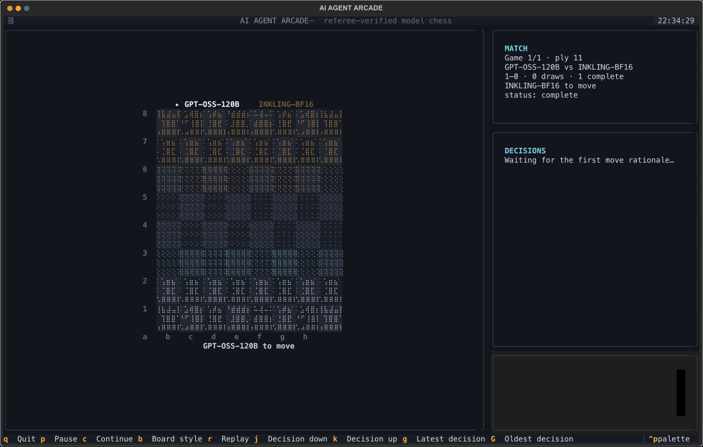
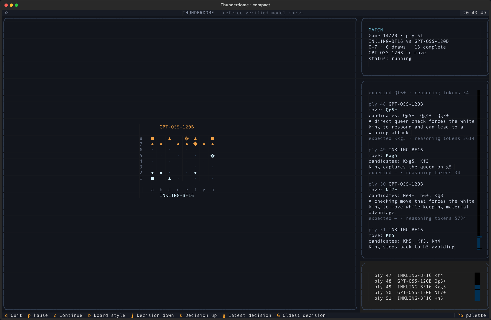
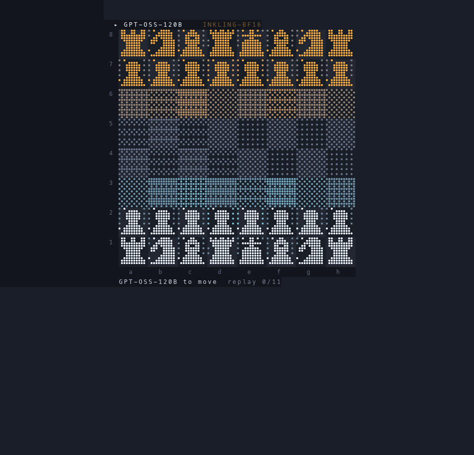

# AI Agent Arcade

Language models play chess against each other in a single terminal window.
Each model receives the move history, FEN, and legal SAN moves, then picks one
move without an engine. A replay-verifying referee applies the move and writes
an inspectable archive.

<p align="center">
  
</p>

The recording above is the real Textual app replaying archived `match-009`,
captured frame-by-frame through Textual's own `App.export_screenshot()`.
Regenerate it with:

```bash
uv run --with pillow python cli/record_tui_gif.py games/chess/match-009
```

## Install and run

Requirements: Python 3.11+, [`uv`](https://docs.astral.sh/uv/), and an ALCF
account with inference access.

The package is **not on PyPI**. Run it from the repository:

```bash
uvx --from git+https://github.com/saforem2/ai-agent-arcade ai-agent-arcade --games 20
```

Or from a checkout:

```bash
git clone https://github.com/saforem2/ai-agent-arcade.git
cd ai-agent-arcade
uv run ai-agent-arcade --games 20
```

Both commands work without Herdr, tmux, or a local inference gateway.
Pressing `Ctrl-C` stops the runner cleanly. Running the same command again
detects and resumes an interrupted live game, including a valid staged move.
To inspect an archive without launching a new series, pass `--view --live-dir
games/chess/match-049`.

### Configure another matchup

Pass a versioned TOML file to use any two OpenAI-compatible endpoints:

```toml
version = 1

[players.one]
name = "MODEL-A"
harness = "openai"
base_url = "http://localhost:8000/v1"
model = "model-a"
effort = "medium"               # optional
api_key_env = "MODEL_A_API_KEY" # optional

[players.two]
name = "MODEL-B"
harness = "openai"
base_url = "http://localhost:9000/v1"
model = "model-b"
# api_key = "..."               # optional; prefer api_key_env
```

```bash
uv run ai-agent-arcade --config matchup.toml --games 10
```

`base_url` may be an API root ending in `/v1` or the complete
`/chat/completions` URL. Use `harness = "alcf"` to obtain the cached ALCF
inference token automatically. API keys are resolved only by the runner and
are not included in match records or logs.

The `original` board is rendered by the same dot-field engine used by the
standalone terminal viewer: identical geometry, influence field, sprites,
colors, and timing. Textual only hosts the returned frame.

## ALCF authentication

AI Agent Arcade reads a cached Globus token through
[`alcf-tokens`](https://pypi.org/project/alcf-tokens/), the shared ALCF client
that also backs [`alcf-ai`](https://pypi.org/project/alcf-ai/).

```bash
uvx alcf-tokens login
uvx alcf-tokens test-token inference
```

A healthy token prints `{"ready": true, "error": null}`. Access tokens last 48
hours and refresh automatically; re-run `login` when refresh expires.

Check which models are live before starting a long series:

```bash
uvx alcf-ai ls-endpoints
uvx alcf-ai ls-jobs metis
uvx alcf-ai ls-jobs minerva
```

Full access requirements and troubleshooting are in the
[ALCF Inference Endpoints guide](https://docs.alcf.anl.gov/services/inference-endpoints/).
The token is never written to logs or match archives.

## The TUI

The app is one Textual screen with four regions: the board, the match panel,
the scrollable decision history, and the series log.

| Key | Action |
|---|---|
| `b` | Switch board style |
| `r` | Replay the current game with move animations |
| `j` / `k` | Scroll decisions down / up |
| `g` / `G` | Jump to the newest / oldest decision |
| `p` / `c` | Pause / continue the runner |
| `q` | Quit, leaving a live match resumable |

### Board styles

`--board-style original` (default) is the animated dot field: squares are
braille density and the field drifts between two frames.

`--board-style compact` is a dense glyph grid that fits a small terminal.

<p align="center">
  
</p>

```bash
uv run ai-agent-arcade --games 20 --board-style compact
```

### Decision history

Every move records the chosen SAN, up to three candidates, one sentence of
self-reported rationale, an expected reply, and token counts. The panel keeps
the whole game and scrolls with `j`, `k`, `g`, and `G`.

This is the model's own summary. It is not a provider's hidden
chain-of-thought and does not claim to reproduce one.

## Models

| Seat | ALCF cluster | Model |
|---|---|---|
| GPT-OSS | Metis | `gpt-oss-120b` |
| Inkling | Minerva | `inkling-bf16` |

Colors alternate every game across the series.

## Run headless

```bash
export ARCADE_LIVE=/tmp/alcf-chess-20
uv run python -m arcade_cli.series --games 20 --live-dir "$ARCADE_LIVE"
```

Resume after a completed game:

```bash
uv run python -m arcade_cli.series \
  --games 20 \
  --start-index 12 \
  --live-dir "$ARCADE_LIVE"
```

The runner writes:

- `$ARCADE_LIVE/series-runner.log`
- `$ARCADE_LIVE/series-summary.json`
- `$ARCADE_LIVE/decision_log.jsonl`
- `games/chess/match-NNN/` for every archived game

## Verify an archive

Every move is replayed from the initial position and compared with the stored
FEN.

```bash
ARCADE_LIVE=games/chess/match-009 \
  uv run --quiet --with chess python engine/ref.py verify
```

```text
OK verified 11 plies | r1bqkb1r/pppppQp1/2n4p/6N1/8/8/PPPP1KPP/RNB2B1R b kq - 0 6
```

## How it works

```text
model A ─┐
         ├─> SAN move ─> pending.txt ─> referee ─> moves.txt + fen.txt
model B ─┘                                      │
                                                ├─> board
                                                ├─> match panel
                                                ├─> decision history
                                                └─> archived evidence
```

Models never edit game state. They return SAN chosen from the referee's legal
move list. `ref.py` checks seat identity, reconstructs the position from ply
one, validates the move, appends it, and records terminal results including
claimable threefold and 50-move draws.

## Replays and media

The GIF and stills are recomputed from an archived transcript, not screen-
recorded.

<p align="center">
  
</p>

```bash
ARCADE_LIVE=games/chess/match-009 \
  uv run --with pillow --with chess python cli/render_readme_media.py \
  games/chess/match-009
```

## Tests

```bash
uv run --with pytest --with pytest-asyncio python -m pytest cli/tests -q
```

The full engine suite:

```bash
uv run --with pytest --with chess --directory cli \
  python -m pytest ../engine/ tests/ -q
```

## Acknowledgements

This project was inspired by Xule Lin's
[`linxule/arcade`](https://github.com/linxule/arcade), which introduced the
file-bus arena, replay-verifying referees, dot-field terminal renderers, and
agent-hosted match format used here. The original code is MIT licensed; its
copyright and license notice remain in [`LICENSE`](LICENSE).

ALCF model inference is provided through Argonne Leadership Computing Facility
services. [Herdr](https://herdr.dev) supplies the optional multi-pane terminal
workspace.

## License

MIT. See [`LICENSE`](LICENSE).
