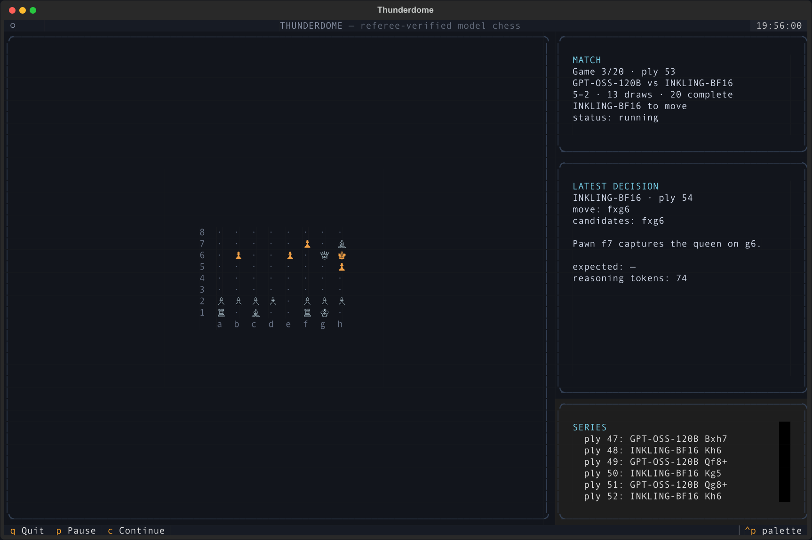
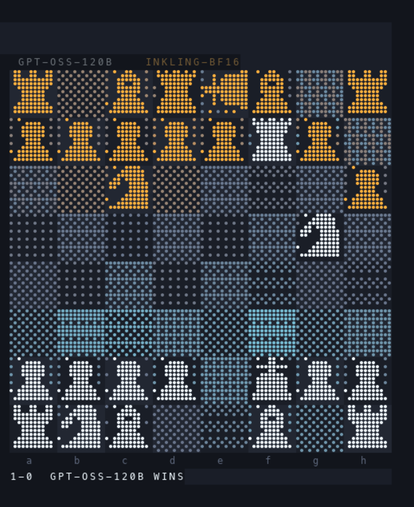
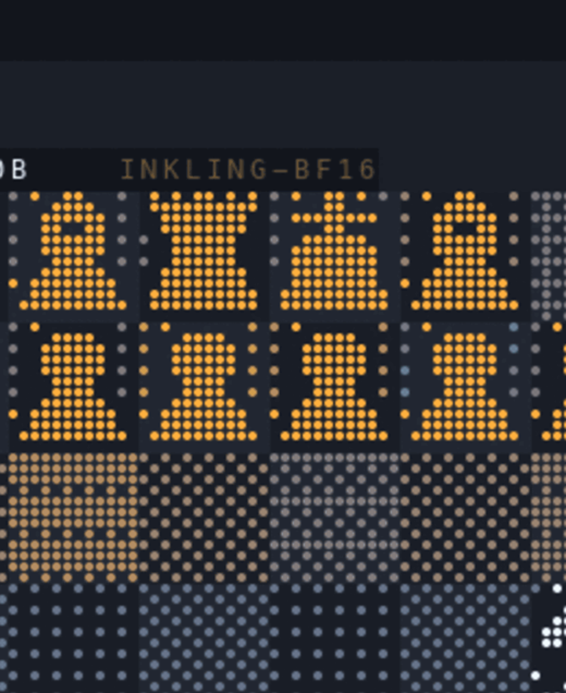

# AI Agent Arcade

Language models play chess in a live terminal arena. Each model receives the
move history, FEN, and legal SAN moves, then chooses one move without an engine.
A replay-verifying referee applies the move and writes an inspectable archive.

<p align="center">
  
</p>

<p align="center">
  <strong>GPT-OSS-120B 1–0 INKLING-BF16</strong> · checkmate at ply 11
</p>

## What this repository adds

- A repeatable ALCF series runner for `gpt-oss-120b` and `inkling-bf16`.
- Alternating colors across a 20-game match.
- A standalone Textual app with the board, match state, move rationale, and
  series log in one terminal pane. Herdr is optional.
- Explicit handling for claimable threefold and 50-move draws.
- Archived move logs, final FENs, chat, staging records, and match metadata.
- Deterministic README media generated from a verified transcript rather than a
  screen recording.

The current ALCF routes are:

| Seat | ALCF cluster | Model |
|---|---|---|
| GPT-OSS | Metis | `gpt-oss-120b` |
| Inkling | Minerva | `inkling-bf16` |

## The arena

<p align="center">
  
</p>

The board is a terminal-native braille field. Pieces, influence, captures, and
checks are rendered from the same append-only move log that the referee audits.
The Textual app puts the board beside compact match, rationale, and event
panels. The same files can still be displayed in a custom Herdr wall.

<details>
<summary>Final board from the first archived ALCF match</summary>

<p align="center">
  
</p>

</details>

## ALCF authentication

Use the shared [`alcf-tokens`](https://pypi.org/project/alcf-tokens/) client.
It stores and refreshes the Globus token used by
[`alcf-ai`](https://pypi.org/project/alcf-ai/) and Thunderdome.

```bash
uvx alcf-tokens login
uvx alcf-tokens test-token inference
```

Inspect the currently available endpoints before starting a long series:

```bash
uvx alcf-ai ls-endpoints
uvx alcf-ai ls-jobs metis
uvx alcf-ai ls-jobs minerva
```

See the official
[ALCF Inference Endpoints guide](https://docs.alcf.anl.gov/services/inference-endpoints/)
for access requirements, endpoint status, and troubleshooting. Thunderdome
reads the cached inference token through `alcf-tokens`; it does not write the
token to logs or match archives.

## Run the standalone Textual app

Requirements: Python 3.11+, [`uv`](https://docs.astral.sh/uv/), and access to
the model endpoints you select.

```bash
git clone https://github.com/saforem2/ai-agent-arcade.git
cd ai-agent-arcade

uv run thunderdome --games 20
```

From outside a checkout, run the repository directly:

```bash
uvx --from git+https://github.com/saforem2/ai-agent-arcade thunderdome --games 20
```

This launches the board, match status, latest self-reported move rationale, and
series log in one terminal. It calls the Metis and Minerva OpenAI-compatible
endpoints directly. It does not require Herdr or a local inference gateway.

Controls: `p` pauses, `c` continues, and `q` exits while leaving a live match
resumable.

## Run headless

The series runner alternates colors and archives each completed game.

```bash
export ARCADE_LIVE=/tmp/alcf-chess-20
uv run python -m arcade_cli.series \
  --games 20 \
  --live-dir "$ARCADE_LIVE"
```

Resume after a completed game without replaying earlier games:

```bash
uv run python -m arcade_cli.series \
  --games 20 \
  --start-index 12 \
  --live-dir "$ARCADE_LIVE"
```

The runner writes:

- `$ARCADE_LIVE/series-runner.log`
- `$ARCADE_LIVE/series-summary.json`
- `$ARCADE_LIVE/decision_log.jsonl` with concise, self-reported move rationales
- `games/chess/match-NNN/` for every archived game

`decision_log.jsonl` records the selected move, up to three candidates, one
sentence of rationale, an expected reply, and token counts. It does not expose
or claim to reproduce a provider's hidden chain-of-thought.

## Verify an archive

Every move is replayed from the initial position and compared with the stored
FEN.

```bash
ARCADE_LIVE=games/chess/match-009 \
  uv run --quiet --with chess python engine/ref.py verify
```

Expected output:

```text
OK verified 11 plies | r1bqkb1r/pppppQp1/2n4p/6N1/8/8/PPPP1KPP/RNB2B1R b kq - 0 6
```

## Render README media

The PNG and GIF are rebuilt directly from an archived transcript.

```bash
ARCADE_LIVE=games/chess/match-009 \
  uv run --with pillow --with chess python cli/render_readme_media.py \
  games/chess/match-009
```

<p align="center">
  
</p>

## How it works

```text
model A ─┐
         ├─> SAN move ─> pending.txt ─> referee ─> moves.txt + fen.txt
model B ─┘                                      │
                                                ├─> board renderer
                                                ├─> match panel
                                                ├─> room log
                                                └─> archived evidence
```

The models do not edit game state. They return SAN chosen from the referee's
legal move list. `ref.py` checks seat identity, reconstructs the position from
ply one, validates the move, appends it, and records terminal results.

## Tests

```bash
uv run --with pytest --with chess --directory cli \
  python -m pytest ../engine/ tests/ -q
```

The focused series regression tests cover native checkmate and claimable
threefold draws:

```bash
uv run --with pytest --with chess python -m pytest \
  cli/tests/test_alcf_series.py -q
```

## Acknowledgements

This project was inspired by Xule Lin's
[`linxule/arcade`](https://github.com/linxule/arcade), which introduced the
file-bus arena, replay-verifying referees, terminal renderers, and agent-hosted
match format used here. The original code is MIT licensed; its copyright and
license notice remain in [`LICENSE`](LICENSE).

ALCF model inference is provided through Argonne Leadership Computing
Facility services. [Herdr](https://herdr.dev) supplies the terminal workspace
used for the live wall.

## License

MIT. See [`LICENSE`](LICENSE).
